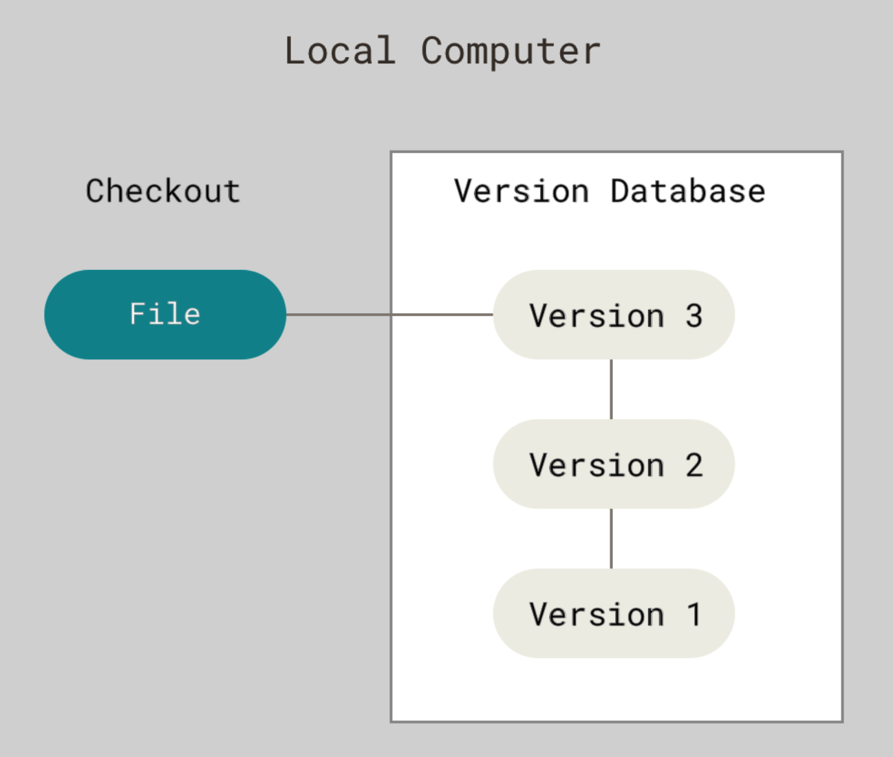
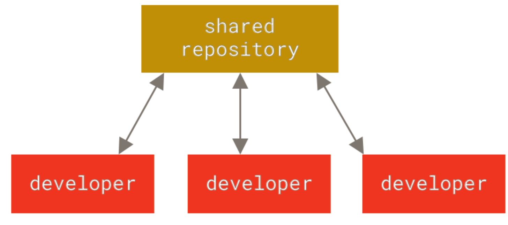
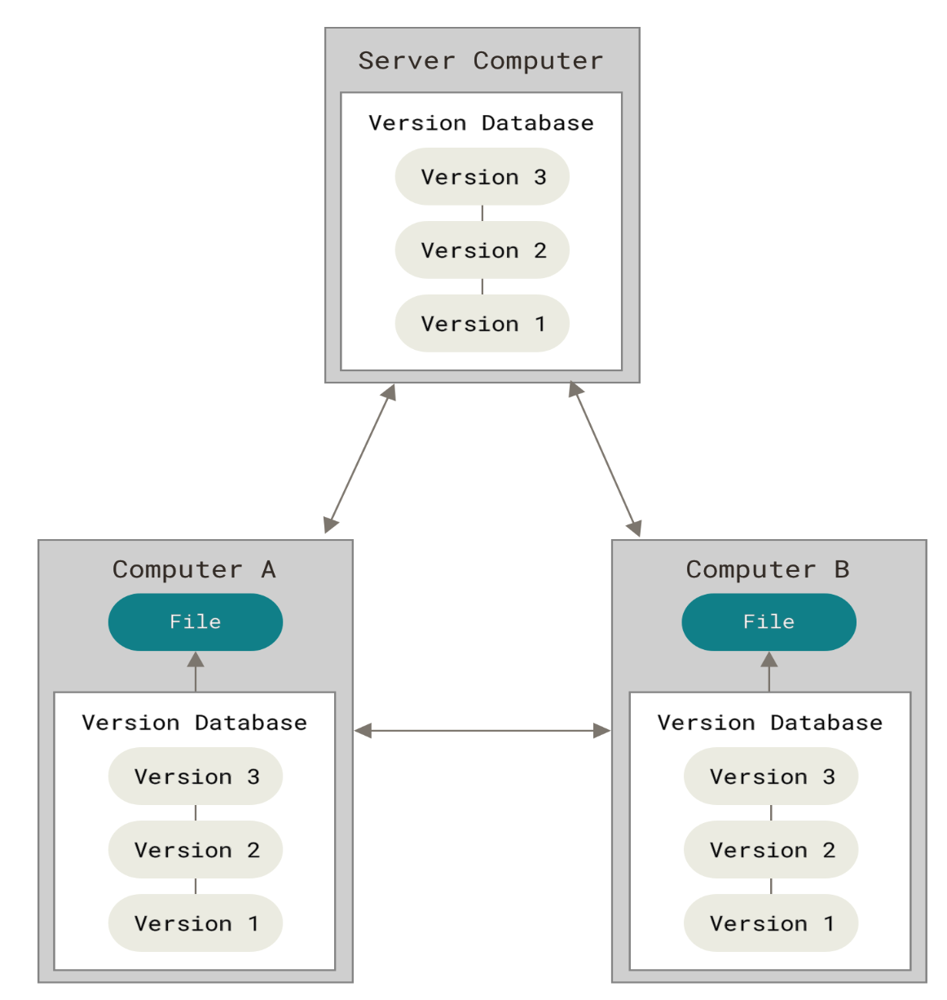

# What is Version Control?

A **Version Control System (VCS)** is a tool that helps manage changes to files over time. It records every modification made to a file or a set of files, allowing teams to monitor progress, track revisions, and coordinate work efficiently.

With a VCS, users can:

    - Maintain a complete history of changes, including who made them and when.
    - Revert to previous versions when errors occur or rollbacks are needed.
    - Work collaboratively, even in parallel, without the risk of overwriting each other’s contributions.
    - Identify and resolve conflicts, ensuring that merged changes are accurate and consistent.

# Types of Version Control

## 1. Local Version Control

!!! note "Local Version Control"
    - Changes are tracked on **your computer only**.  
    - Simple but risky → if your system crashes, you lose everything.  
    - Example: *Saving multiple copies manually*  

{ width="400" height="250" }

---

## 2. Centralized Version Control (CVCS)

!!! info "Centralized Version Control"
    - There's **one main server** that holds all files.  
    - Everyone gets files from it and pushes their changes to it.  
    - Problem → If that server fails, **everything stops**.  
    - Example: *Subversion (SVN), Perforce*  

{ width="400" height="250" }

---

## 3. Distributed Version Control (DVCS)

!!! success "Distributed Version Control"
    - Everyone has a **full copy of the entire project history**.  
    - You don’t need to be online to track changes.  
    - Safer and faster → if one system crashes, others still have the full project.  
    - Example: *Git, Mercurial*  

{ width="400" height="250" }

---

## Quick Comparison

| Feature   | Local VCS | Centralized VCS | Distributed VCS |
|-----------|-----------|-----------------|-----------------|
| Storage   | Only on your computer | On a central server | On every developer’s system |
| Risk      | ❌ High – system crash = data loss | ⚠️ Medium – server crash = downtime | ✅ Low – copies everywhere |
| Examples  | Manual copies | SVN, Perforce | Git, Mercurial |

---

!!! tip "Remember"
    - Local VCS → Simple but risky  
    - Centralized VCS → Solved some issues, but still had a **single point of failure**  
    - Distributed VCS → **Best of both worlds**, making Git the most widely used system today
